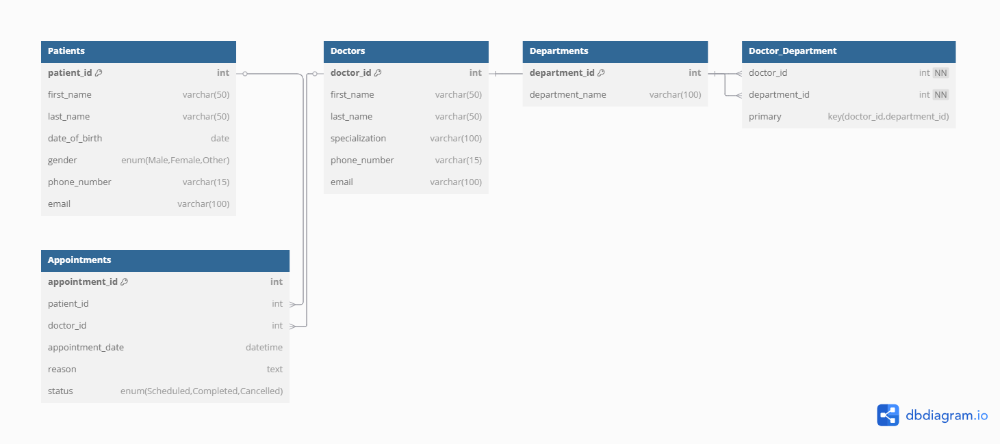

# 🏥 Clinic Booking System

## 📌 Description

A simple Clinic Booking System built using MySQL. It allows storing and managing data about patients, doctors, departments, and appointments, with clear relational constraints.

## 🚀 How to Run / Setup

1. Open MySQL Workbench or any SQL interface.
2. Import and run the `clinic_booking_system.sql` script.
3. This will create all tables and relationships for the Clinic Booking System.

## 🔗 ERD Screenshot

Or view it online: [dbdiagram.io ERD](https://dbdiagram.io/d/ER-Diagram-68232a6a5b2fc4582f615f43)

## 📁 Files in This Repo

- `clinic_booking_system.sql`: SQL script with table definitions and sample data
- `README.md`: Project overview and setup instructions
- `images/clinic-erd.png`: ER diagram
